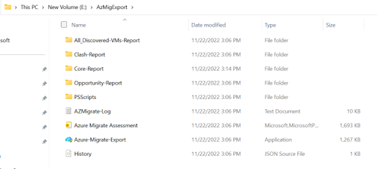

# Azure Migrate Export - Common questions

This article answers common questions about Azure Migrate Export.

## Frequently Asked Questions

### How do we find the BasePath?

Open the location where you installed the Azure Migrate Export Utility Package and copy the path of folder where all the discovery and assessment reports are present.
Basepath for the example below is E:\AzMigExport.

 
### I can’t find the publish button on the PowerBI desktop application.
The **Publish** button is available on the top-right of the home tab in PowerBI export. Publish facility is not available for users having Free PowerBI license. Such users can do customizations and export PowerBI as PDF.

### Is my data secured?
Azure Migrate Export only uses Azure Migrate APIs to request for data insights. No data is stored.

### Are passwords stored in Azure Migrate Export?
No, passwords are not stored in Azure Migrate Export.

### As a Partner or Seller, I want to generate the presentation but want my customer to run the Module. Is that possible?
Yes. You can ask your customers to download the Azure Migrate Export Utility Package and run Azure Migrate Export. Once discovery and assessment is complete, your customer can send you the AzMigExport folder with all the 4 discovery and assessment reports and PowerBI template. You may then run the PowerBI template by providing the required basepath. [Learn More](how-to--find-basepath) on how to find basepath.

### If my VM is powered off, will I still get its assessment consideration?
Yes, it will be assessed for VM assessment only since its performance data will be unavailable.
