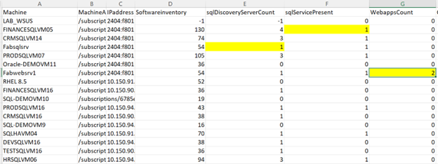
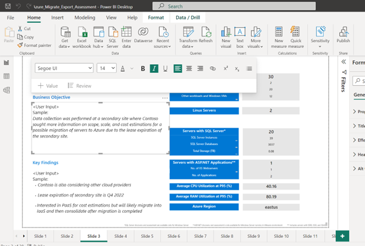

# Customize reports
This article describes how to customize the generated reports to improve the usability and for easy access to the necessary information.

## Customize Discovery Report
To customize, open the **Discovered_VMs** excel report which is generated at ```\AzMigExport\All_Discovered-VMs-Report\Discovered_VMs.xlsx```.
There are three types of customizations that a user can apply in discovery file:
1. Moving Servers out of Scope: VMs and machines that a customer doesn’t wish to migrate to azure can be moved out of scope for assessment and migration estimates.
The discovery file consists of details of discovered servers. Users can delete the required row in discovery file to move VM out of scope. Such VMs will not be considered for any type of assessment.
2. Limit Workload for respective assessment: If you want to avoid workloads like SQL Server or .NET WebApps to be considered for respective PaaS assessments, that is, Azure SQL MI and Azure App Service respectively, you can change the count in the respective column to 0; such workloads now will only be considered for migration to Azure VM via lift and shift.
   
For example, If a user does not want to assess the “Fabsqlsrv” Machine for SQL Managed Instance but instead wants to rehost the server to Azure VM, then they should set the respective sqlDiscoveryServerCount to 0. 

Similarly, if the user doesn’t wish to get a separate Azure VM recommended for a VM running Azure SQL Services, then they should set the respective sqlServicePresent to 0.

Similarly, if a user does not want to assess the “Fabwebsrv1” machine for Azure App Service  but instead wants to rehost the server to Azure VM, then they should set the respective WebappsCount to 0.
3.	Mark servers as Dev: Azure offers special discount pricing for machines in Dev/Test environment. You can categorize the servers into dev and prod environments by entering “Dev” and “Prod” in the **Environment Type** column in discovered report, so that adequate pricing considerations are applied at the time of assessment. Servers where environment type cells are blank are considered as production servers by default. 

## Customize Assessment Core Report
Users can choose to customize Assessment Core Report for duplicates in assessment, removing servers out of scope and more. Cost Estimates in PowerBI are generated for only those machine rows that are part of Assessment Core Report and Assessment Opportunity report. 
Duplicates can be identified with the help of Clash report. [Learn More](#interpreting-clash-report) about interpreting Clash reports. By deleting the lines of a machine in respective assessment, users can choose to opt-out from getting recommendation and cost estimations.

For example 1: A Server (Contoso) has 3 SQL instances (A,B,C) running, as follows:
1. A is ready for Azure SQL MI (details available in “SQL_MI_PaaS” tab in Core report),
2. B is ready for Instance Rehost to Azure VM (details available in “SQL_IaaS_Instance_Rehost_Perf” tab in Core report)
3. C can neither be migrated to Azure SQL MI nor is ready for Instance rehost to Azure VM, AME recommends SQL Server rehost to Azure VM for such deployments. (details available in “SQL_IaaS_Server_Rehost_Perf” tab in Core report)

In such scenario, A machine with 3 instances is considered in 3 assessment and would lead to duplicates. The Clash report highlights such scenarios and provides a count of recommended Target resources for each source machine in-scope. [Learn More](#interpreting-clash-report) about interpreting Clash reports.

Now suppose, User understands that Contoso is a Dev Server and wants to only do a Server Rehost of such SQL Server and chooses not to migrate its instances to PaaS. User can in that case delete rows of respective SQL Server and SQL Server instances from “SQL_MI_PaaS” and “SQL_IaaS_Instance_Rehost_Perf” tab in Core report. The PowerBI will now only calculate the cost of Contoso Rehost to Azure VM.
For Example 2: Suppose a Webapp Server is running 2 Webapp (A and B), one of which is ready for migration to Azure App Service, However another is not. In that case, user will find this Web App server in both “WebApp_PaaS” and “WebApp_IaaS_Server_Rehost_Perf”. User can choose to only Server Rehost this Web App and should delete the required Server and Webapp row in “WebApp_PaaS” tab in Core report.
For Example 3: A Server is running both Webapp and SQL Server Instance, SQL Server Instance is ready for Azure MI but Webapp is not ready for Azure App Service, In such a case, this server will be recommended in “SQL_MI_PaaS” and  “WebApp_IaaS_Server_Rehost_Perf”. Now if the User decides to rehost the server and not take the SQL Instance to Azure SQL MI, the User should delete the respective row from “SQL_MI_PaaS” tab in the Core report.


## Customize PowerBI Report
The PowerBI report consists of situational verbatims that need to be customized as per the required scenario. The User needs to click on the required text box and make the required changes as below:
 

> [!Note]
> You are requested not to change any number boxes as it may make your report prone to errors.
