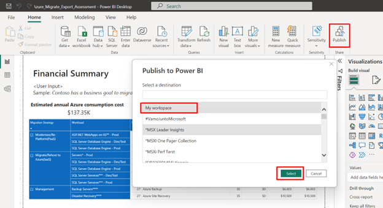
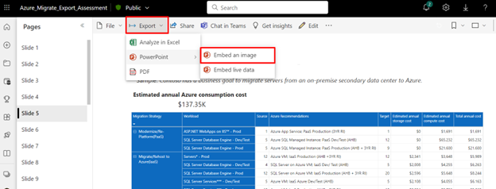

# Run Azure Migrate Export with customization
This article describes the procedure to run Azure Migrate Export with customizations.

### Prerequisites 
- Review the prerequisites for running Azure Migrate Export.
- Before running Azure Migrate Export, users must have successfully set up an Azure Migrate Project, deployed an Azure Migrate appliance, and should have successfully performed discovery using the Azure Migrate: Discovery and Assessment tool.
- There are two workflows in which users can run Azure Migrate Export Utility.
   - Run without Customization or Single Click Experience - Aims to quickly generate required output with certain assumptions such as all machines discovered are in-scope and belong to Production environment.
   - Run with Customization - Aims to allow for customization such as classification of environment such as dev/prod to take advantage of Dev/Test pricing, moving machines out of scope for an assessment or moving machines out of scope of migration and even the visualization. [Learn More](#how-to-customize-discovery-report) on how to customize Discovery file.

### Run Azure Migrate Export
To run AME with customization, users need to first generate the discovery report, apply customization, and then run assessment. Follow these steps:
1. Download the Azure Migrate Export utility package and extract the contents on the package. [Learn More](#how-to-get-azure-migrate-export-utility-package) about how to get Azure Migrate Export Utility Package.
2. Run Azure Migrate Export application.
3. On the console, Select Workflow Option as Discovery.
4. In **Source Appliance**, select the source of servers. By default, all three sources, namely VMware, Hyper-V, and Physical are selected.
5. Enter the project identifier details such as Tenant ID, Subscription ID, Resource Group name, and Discovery Site name. [Learn More](#how-to-find-project-discovery-and-assessment-parameters) on where to find the Project Identifier.
6. Select the Target location where you want to move your resources and select **Submit**.
7. Users will now be prompted to authenticate for Azure access.
8. Once the user is authenticated in Azure, the discovery runs to generate the “Discovery_VMs” report which provides details of all servers discovered in your environment from the selected source type.
9. Apply the required customizations on the Discovery report and save the file. [Learn More](#how-to-customize-discovery-report) on how to customize discovery file.
10. On the console, select Workflow option as Assessment.
11. Enter the project identifiers such as Tenant ID, Subscription ID, Resource Group name, and Assessment project name. [Learn More](#how-to-find-project-discovery-and-assessment-parameters) on where to find the project identifiers.
12. Select the Assessment duration for which you want to run assessment and click **Submit**.
13. Users will now be prompted to authenticate Azure access.
14. Once the user is authenticated in Azure, the assessment runs to generate Core Report, Opportunity Report and Clash Report. [Learn More](#discovery-and-assessment-report-analysis) about highlights of the report.
   > [!Note]
   > An assessment typically runs in 1-2 hours but may take more time depending on the size of environment.
15. Users can choose to customize assessment reports for removing required duplicates in assessment. [Learn More](#how-to-customize-assessment-core-report) about how to customize assessment reports.
16. Run the “Azure_Migrate_Export.pbit” PowerBI template provided in the Utility package.
17. Provide the path of utility package where all the reports are generated and click Load. [Learn More](#how-to--find-basepath) about the base Path.
18. Once the data is loaded, Users can now choose to change static data in PowerBI report to customize as per requirement. [Learn More](#how-to-customize-powerbi-report) about how to customize PowerBI Report.
19. After finalizing the slides, publish the PowerBI report on your workspace.
   
20. You can download the Azure Migrate Export Executive Presentation as PPT from your workspace.
   

